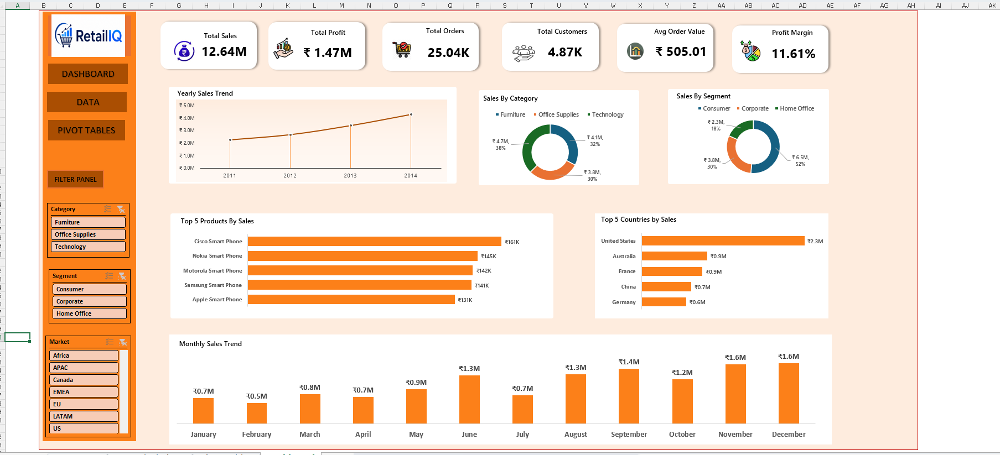

# Retail Sales Analysis & Executive Dashboard

## Project Overview

An interactive retail sales analysis and executive dashboard built using Microsoft Excel to analyze sales performance, profitability, customers, products, markets, and sales trends.

## Dashboard Preview



## Business Objectives

- Monitor overall sales and profitability performance
- Analyze sales trends over time
- Identify high-performing categories, markets, and products
- Understand customer segment performance
- Evaluate the relationship between discounts and profitability
- Provide an interactive dashboard for business decision-making

## Tools & Technologies

- Microsoft Excel
- Power Query
- Pivot Tables
- Pivot Charts
- Advanced Excel Formulas
- Slicers
- Timelines

## Key KPIs

- Total Sales
- Total Profit
- Profit Margin
- Total Orders
- Total Customers
- Average Order Value (AOV)
- Average Discount

## Business Questions

- What are the overall sales and profit levels?
- Which markets and regions perform best?
- Which product categories contribute the most sales?
- Which products are the top performers?
- Which customer segments generate the most revenue?
- How do discounts relate to profitability?
- How do sales change over time?

## Project Workflow

1. Data preparation and profiling
2. Data cleaning using Power Query
3. KPI definition and calculation
4. Data analysis using Pivot Tables
5. Visualization using Pivot Charts
6. Dashboard development
7. Interactive filtering using slicers

## Repository Structure

```text
Retail-Sales-Analysis-Excel/
│
├── README.md
├── Dashboard.png
├── Retail-Sales-Analysis-Dashboard.xlsx
│
└── Documentation/
    ├── Business-Requirements.md
    ├── KPI-Definitions.md
    ├── Data-Cleaning-Strategy.md
    └── Dashboard-Design.md
